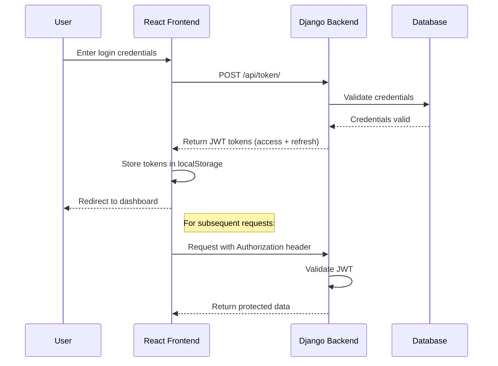
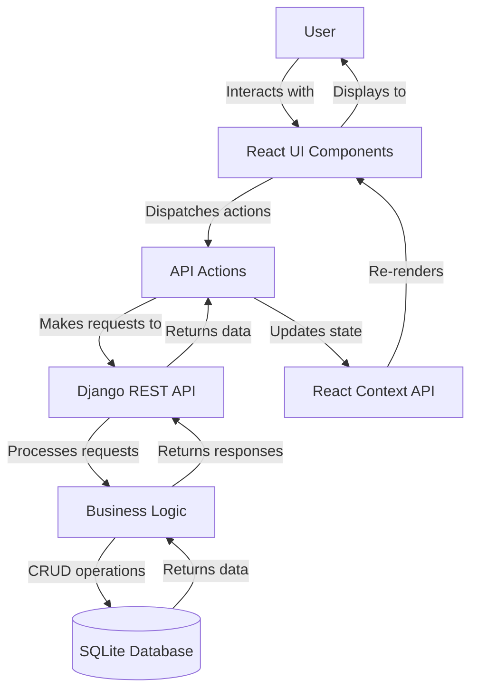
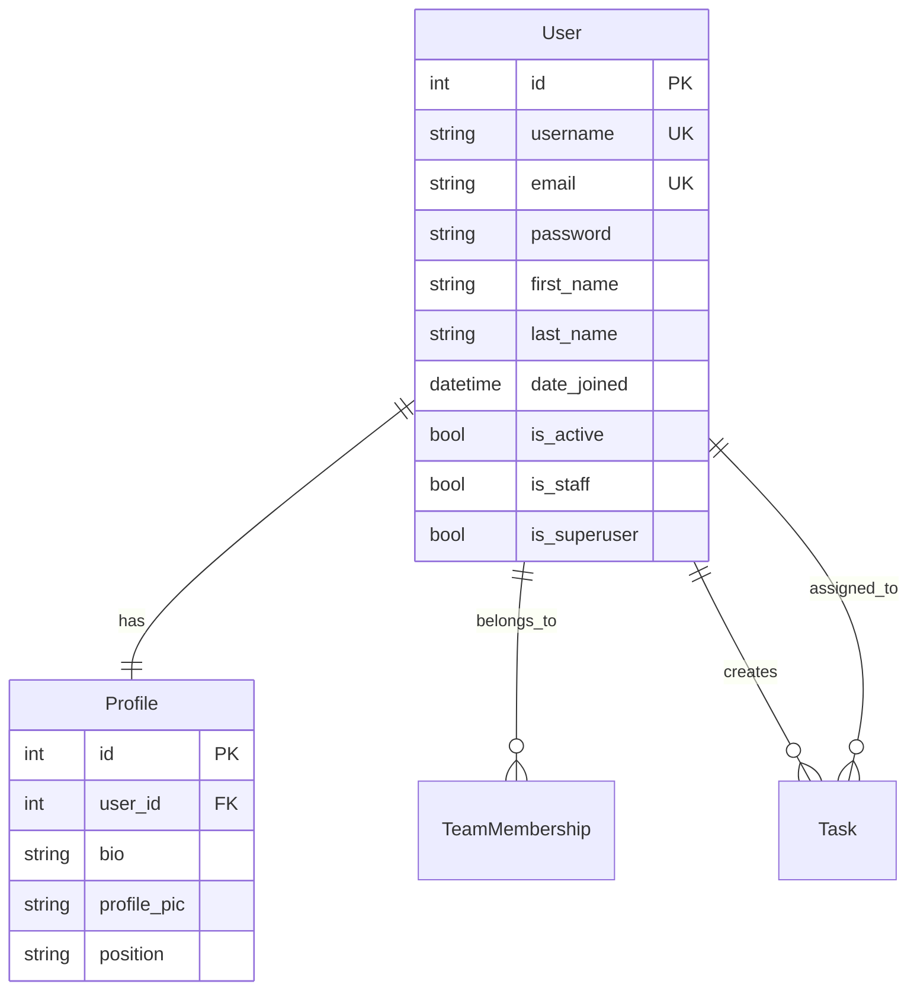
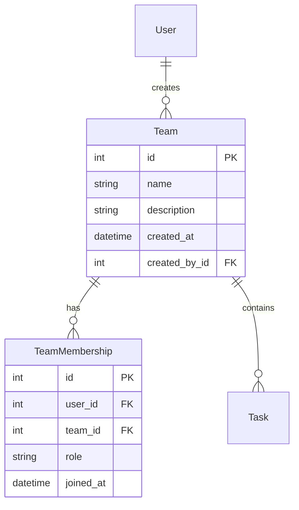
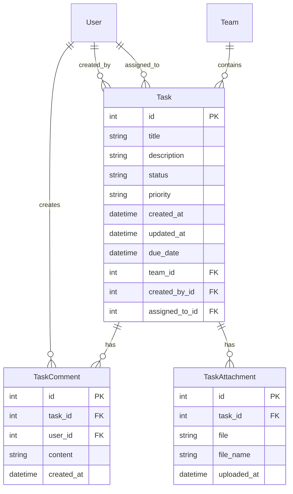
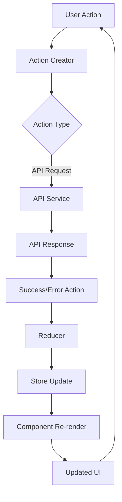

# TaskHeaven - Advanced Task & Team Management System

<div align="center">
  
  
  <h3>A modern, collaborative task management solution for teams</h3>

  
  
  
  
  
  
</div>

## Table of Contents

- [Overview](#-overview)
- [Key Features](#-key-features)
- [Technology Stack](#-technology-stack)
- [System Architecture](#-system-architecture)
- [Screenshots & Demo](#-screenshots--demo)
- [Installation & Setup](#-installation--setup)
  - [Prerequisites](#prerequisites)
  - [Backend Setup](#backend-setup)
  - [Frontend Setup](#frontend-setup)
  - [Environment Variables](#environment-variables)
- [API Documentation](#-api-documentation)
- [Database Schema](#-database-schema)
- [Project Structure](#-project-structure)
- [Security Implementations](#-security-implementations)
- [Testing](#-testing)
- [Deployment](#-deployment)
- [Performance Optimizations](#-performance-optimizations)
- [Challenges & Solutions](#-challenges--solutions)
- [Contributing](#-contributing)
- [License](#-license)
- [Acknowledgements](#-acknowledgements)

## Overview

TaskHeaven is a comprehensive task and team management web application built with Django (backend) and React (frontend). It offers robust user authentication, role-based team management, detailed task tracking, and real-time collaboration features. Designed with scalability and user experience in mind, TaskHeaven helps teams streamline their workflows, improve productivity, and enhance communication.

The application follows modern development practices, implementing a RESTful API architecture, JWT authentication, proper state management, and responsive design. With its intuitive interface and powerful features, TaskHeaven is suitable for teams of all sizes across various industries.

## Key Features

| Feature Category | Capabilities |
|------------------|--------------|
| **User Management** | - Secure registration and authentication<br>- Profile management<br>- Role-based access control |
| **Team Management** | - Create and manage teams<br>- Add/remove team members<br>- Assign admin privileges<br>- Team activity tracking |
| **Task Management** | - Create, edit, and delete tasks<br>- Assign tasks to team members<br>- Set priorities and deadlines<br>- Track task progress<br>- Task filtering and sorting |
| **Dashboard** | - Personalized overview<br>- Task summaries<br>- Team activities<br>- Performance metrics |
| **Collaboration** | - Task comments<br>- Team discussions<br>- @mentions and notifications |
| **Analytics** | - Team performance tracking<br>- Task completion rates<br>- Time tracking metrics |

### Feature Breakdown

<details>
<summary><strong>User Authentication & Management</strong></summary>

- Secure user registration with validation
- JWT-based authentication system
- Password reset functionality
- User profile customization
- Profile picture upload
- User role management
- Session management
- Account settings and preferences
</details>

<details>
<summary><strong>Team Management</strong></summary>

- Create multiple teams for different projects/departments
- Team descriptions and details
- Add/remove team members
- Assign team admin roles
- Team member search functionality
- Team activity timeline
- Admin control panel for team settings
</details>

<details>
<summary><strong>Task Management</strong></summary>

- Comprehensive task creation with details
- Task categories and tags
- Priority levels (Low, Medium, High, Urgent)
- Task statuses (ToDo, In Progress, Review, Done)
- Due date tracking with reminders
- File attachments
- Task dependencies
- Task filtering and sorting
- Bulk actions for tasks
</details>

<details>
<summary><strong>Dashboard & Analytics</strong></summary>

- Personalized user dashboard
- Task completion statistics
- Upcoming deadlines
- Team performance metrics
- Workload distribution charts
- Time tracking analytics
- Productivity insights
</details>

## Technology Stack

TaskHeaven leverages a modern, robust technology stack designed for performance, scalability, and developer experience:

### Backend

| Technology | Purpose | Version |
|------------|---------|---------|
| [Django](https://www.djangoproject.com/) | Web framework | 4.2.x |
| [Django REST Framework](https://www.django-rest-framework.org/) | API development | 3.14.x |
| [PostgreSQL](https://www.postgresql.org/) | Database | 14.x |
| [Simple JWT](https://django-rest-framework-simplejwt.readthedocs.io/) | JWT authentication | 5.2.x |
| [Django CORS Headers](https://github.com/adamchainz/django-cors-headers) | CORS support | 4.1.x |
| [Redis](https://redis.io/) | Caching & messaging | 7.0.x |

### Frontend

| Technology | Purpose | Version |
|------------|---------|---------|
| [React](https://reactjs.org/) | UI library | 18.x |
| [React Router](https://reactrouter.com/) | Routing | 6.x |
| [Axios](https://axios-http.com/) | HTTP client | 1.4.x |
| [Tailwind CSS](https://tailwindcss.com/) | Styling | 3.3.x |
| [Redux Toolkit](https://redux-toolkit.js.org/) | State management | 1.9.x |
| [React Query](https://tanstack.com/query/latest) | Data fetching | 4.29.x |
| [React Hook Form](https://react-hook-form.com/) | Form handling | 7.45.x |

## System Architecture

TaskHeaven follows a modern client-server architecture with clearly separated frontend and backend components:

```
┌─────────────────┐     ┌──────────────────────────┐     ┌─────────────────┐
│                 │     │                          │     │                 │
│   React SPA     │◄────┤    RESTful API Layer     │◄────┤     SQLite      │
│   (Frontend)    │     │    (Django REST API)     │     │   Database      │
│                 │────►│                          │────►│                 │
└─────────────────┘     └──────────────────────────┘     └─────────────────┘
        ▲                           ▲                            ▲
        │                           │                            │
        │                           ▼                            │
        │                  ┌─────────────────┐                   │
        │                  │                 │                   │
        └──────────────────┤  Redis Cache    ├───────────────────┘
                           │                 │
                           └─────────────────┘
                                    ▲
                                    │
                                    ▼
                           ┌─────────────────┐
                           │                 │
                           │ Celery Workers  │
                           │                 │
                           └─────────────────┘
```

### Key Architecture Components

1. **Frontend (React SPA)**
   - Single page application built with React 18
   - Client-side routing with React Router
   - State management with Context API and hooks
   - RESTful API consumption via Axios
   - Responsive UI with Tailwind CSS

2. **Backend (Django REST Framework)**
   - RESTful API endpoints
   - JWT-based authentication
   - Request validation and serialization
   - Business logic implementation
   - Database ORM

3. **Database (SQLite)**
   - Relational data storage
   - Complex query optimization
   - Data integrity enforcement
   - Transaction management

4. **Caching Layer (Redis)**
   - Session storage
   - Frequent query caching
   - Rate limiting

5. **Background Processing (Celery)**
   - Asynchronous task execution
   - Email notifications
   - Report generation
   - Scheduled tasks

### Authentication Flow



### Data Flow Architecture



## Screenshots & Demo


| Feature Description | Screenshot |
|---------------------|------------|
| **User Authentication - Login Page** <br><br> The login page provides secure access to the TaskFlow platform. Users can enter their credentials to access their personalized dashboard, teams, and tasks. The interface features a clean, modern design with intuitive form fields for username and password, as well as a login button to authenticate users. |  |
| **User Registration** <br><br> New users can create an account through the registration page. This page captures essential user information to set up a new profile. The registration form includes fields for personal details and account credentials, ensuring a smooth onboarding process for new team members. |  |
| **Main Dashboard** <br><br> The central hub of the TaskFlow platform displays an overview of important metrics, recent activities, and pending tasks. Users can quickly assess their workload, track progress on ongoing projects, and access all platform features from this comprehensive dashboard. The intuitive layout prioritizes important information while maintaining a clean, uncluttered appearance. |  |
| **Team Management - Team List** <br><br> Access all teams you're a member of from this consolidated view. The team list provides a quick overview of all your team affiliations, making it easy to navigate between different group projects and access team-specific information and tasks. Each team entry includes basic details and quick-access options. |  |
| **Team Details Page** <br><br> The team details page offers comprehensive information about a specific team, including member list, pending tasks, and upcoming deadlines. This centralized view helps team members stay coordinated by providing visibility into team activities, responsibilities, and progress towards goals. |  |
| **Member Management** <br><br> Easily add new members to your team by searching for their username. The member management feature enables team administrators to quickly find and invite collaborators to join their team. The search functionality makes it simple to locate specific users within the platform database. |  |
| **Task Filtering and Search** <br><br> Efficiently locate specific tasks with powerful filtering and search capabilities. Users can quickly find assignments based on various criteria such as status, priority, due date, or keywords. This feature helps team members manage their workload and focus on the most critical tasks. |  |
| **Task Creation** <br><br> Create detailed task entries with customizable fields for title, description, assignees, due dates, and priority levels. The task creation interface makes it simple to define new work items with all necessary information. Team members can quickly generate structured tasks that clearly communicate expectations and requirements. |  |
| **Task Comments** <br><br> Foster team collaboration through a robust commenting system on tasks. Team members can add comments to provide updates, ask questions, or share insights related to specific tasks. This communication feature facilitates seamless collaboration and keeps all task-related discussions organized in one place. |  |


## 🛠 Installation & Setup

### Prerequisites

Before installing TaskHeaven, ensure you have the following installed:

- Python 3.8+ ([Download](https://www.python.org/downloads/))
- Node.js 16+ ([Download](https://nodejs.org/))
- PostgreSQL 13+ ([Download](https://www.postgresql.org/download/))
- Redis 6+ ([Download](https://redis.io/download))
- Git ([Download](https://git-scm.com/downloads))

### Backend Setup

1. **Clone the repository**
   ```bash
   git clone https://github.com/officiallyutso/TaskHeaven.git
   cd TaskHeaven
   ```

2. **Create and activate a virtual environment**
   ```bash
   # For Unix/macOS
   python -m venv venv
   source venv/bin/activate
   
   # For Windows
   python -m venv venv
   venv\Scripts\activate
   ```

3. **Install backend dependencies**
   ```bash
   pip install -r requirements.txt
   ```

4. **Set up the database**
   ```bash
   # Create a SQLite database
   createdb taskheaven
   
   # Run migrations
   python manage.py migrate
   ```

5. **Create a superuser (admin)**
   ```bash
   python manage.py createsuperuser
   ```

6. **Run the development server**
   ```bash
   python manage.py runserver
   ```

### Frontend Setup

1. **Navigate to the frontend directory**
   ```bash
   cd frontend
   ```

2. **Install frontend dependencies**
   ```bash
   npm install
   ```

3. **Start the development server**
   ```bash
   npm start
   ```

4. **The application should now be running at:**
   - Backend: `http://localhost:8000/`
   - Frontend: `http://localhost:3000/`
   - Admin interface: `http://localhost:8000/admin/`

### Environment Variables

Create a `.env` file in the root directory with the following variables:

```
# Django settings
DEBUG=True
SECRET_KEY=your_secret_key_here
ALLOWED_HOSTS=localhost,127.0.0.1

# Database settings
DB_NAME=taskheaven
DB_USER=sqlite
DB_PASSWORD=your_db_password
DB_HOST=localhost
DB_PORT=5432

# JWT settings
JWT_SECRET_KEY=your_jwt_secret_key
JWT_ACCESS_TOKEN_LIFETIME=60
JWT_REFRESH_TOKEN_LIFETIME=1440

# Redis settings
REDIS_URL=redis://localhost:6379/0

# Email settings
EMAIL_HOST=smtp.gmail.com
EMAIL_PORT=587
EMAIL_USE_TLS=True
EMAIL_HOST_USER=your-email@gmail.com
EMAIL_HOST_PASSWORD=your-email-password
```

### Docker Setup (Alternative)

For a containerized setup, use Docker Compose:

1. **Build and run the containers**
   ```bash
   docker-compose up -d --build
   ```

2. **Run migrations inside the container**
   ```bash
   docker-compose exec backend python manage.py migrate
   ```

3. **Create a superuser**
   ```bash
   docker-compose exec backend python manage.py createsuperuser
   ```

4. **The application will be available at:**
   - Frontend: `http://localhost:3000/`
   - Backend API: `http://localhost:8000/api/`
   - Admin interface: `http://localhost:8000/admin/`

## API Documentation

TaskHeaven provides a comprehensive RESTful API for all functionality. Here's a detailed breakdown of the available endpoints:

### Authentication Endpoints

| Endpoint | Method | Description | Request Body | Response |
|----------|--------|-------------|-------------|----------|
| `/api/token/` | POST | Obtain JWT token | `{ "username": "string", "password": "string" }` | `{ "access": "string", "refresh": "string" }` |
| `/api/token/refresh/` | POST | Refresh JWT token | `{ "refresh": "string" }` | `{ "access": "string" }` |
| `/api/users/register/` | POST | Register new user | `{ "username": "string", "email": "string", "password": "string", "first_name": "string", "last_name": "string" }` | `{ "user": {}, "message": "string" }` |

### User Management

| Endpoint | Method | Description | Request Body | Response |
|----------|--------|-------------|-------------|----------|
| `/api/users/profile/` | GET | Get current user profile | - | `{ "user": {}, "profile": {} }` |
| `/api/users/profile/` | PUT | Update user profile | `{ "bio": "string", "position": "string" }` | `{ "id": "int", "user": {}, "bio": "string", "position": "string" }` |
| `/api/users/search/` | GET | Search for users | Query param: `query` | `[{ "id": "int", "username": "string", ... }]` |

### Team Management

| Endpoint | Method | Description | Request Body | Response |
|----------|--------|-------------|-------------|----------|
| `/api/teams/` | GET | List user's teams | - | `[{ "id": "int", "name": "string", ... }]` |
| `/api/teams/` | POST | Create new team | `{ "name": "string", "description": "string" }` | `{ "id": "int", "name": "string", ... }` |
| `/api/teams/{id}/` | GET | Get team details | - | `{ "id": "int", "name": "string", ... }` |
| `/api/teams/{id}/` | PUT | Update team | `{ "name": "string", "description": "string" }` | `{ "id": "int", "name": "string", ... }` |
| `/api/teams/{id}/` | DELETE | Delete team | - | `204 No Content` |
| `/api/teams/{id}/members/` | GET | List team members | - | `[{ "id": "int", "user": {}, "role": "string", ... }]` |
| `/api/teams/{id}/members/` | POST | Add team member | `{ "user": "int", "role": "string" }` | `{ "id": "int", "user": {}, "role": "string", ... }` |
| `/api/teams/{id}/members/{user_id}/` | DELETE | Remove team member | - | `204 No Content` |

### Task Management

| Endpoint | Method | Description | Request Body | Response |
|----------|--------|-------------|-------------|----------|
| `/api/tasks/` | GET | List tasks | Query params: `team`, `status`, `assigned_to` | `[{ "id": "int", "title": "string", ... }]` |
| `/api/tasks/` | POST | Create task | `{ "title": "string", "description": "string", "team": "int", ... }` | `{ "id": "int", "title": "string", ... }` |
| `/api/tasks/{id}/` | GET | Get task details | - | `{ "id": "int", "title": "string", ... }` |
| `/api/tasks/{id}/` | PUT | Update task | `{ "title": "string", "status": "string", ... }` | `{ "id": "int", "title": "string", ... }` |
| `/api/tasks/{id}/` | DELETE | Delete task | - | `204 No Content` |
| `/api/tasks/{id}/comments/` | GET | List task comments | - | `[{ "id": "int", "content": "string", ... }]` |
| `/api/tasks/{id}/comments/` | POST | Add task comment | `{ "content": "string" }` | `{ "id": "int", "content": "string", ... }` |

### API Authentication

All API endpoints (except authentication and registration) require JWT authentication. Include the JWT token in the Authorization header:

```
Authorization: Bearer <access_token>
```

### API Rate Limiting

To prevent abuse, the API implements rate limiting:

- Anonymous users: 20 requests per minute
- Authenticated users: 60 requests per minute

### API Versioning

The API uses URL-based versioning. The current version is v1, accessed via `/api/v1/...`

## Database Schema

TaskHeaven uses a relational database model with the following core entities:

### User-Related Tables



### Team-Related Tables



### Task-Related Tables



### Database Indices

To optimize database performance, the following indices are implemented:

| Table | Field(s) | Index Type | Purpose |
|-------|----------|------------|---------|
| User | username | B-tree (unique) | Fast user lookups |
| User | email | B-tree (unique) | Email uniqueness enforcement |
| TeamMembership | (user_id, team_id) | B-tree (unique) | Unique team membership enforcement |
| Task | team_id | B-tree | Fast team-based task filtering |
| Task | assigned_to_id | B-tree | Fast user-based task filtering |
| Task | status | B-tree | Fast status-based filtering |
| Task | due_date | B-tree | Date-based sorting and filtering |

## Project Structure

TaskHeaven follows a well-organized project structure to maintain code clarity and separation of concerns:

### Backend Structure

```
taskheaven/
├── core/                   # Django project settings
│   ├── __init__.py
│   ├── asgi.py
│   ├── settings.py
│   ├── urls.py
│   └── wsgi.py
├── users/                  # User management app
│   ├── migrations/
│   ├── __init__.py
│   ├── admin.py
│   ├── apps.py
│   ├── models.py           # User profile models
│   ├── serializers.py      # User-related serializers
│   ├── urls.py             # User API routes
│   └── views.py            # User API views
├── teams/                  # Team management app
│   ├── migrations/
│   ├── __init__.py
│   ├── admin.py
│   ├── apps.py
│   ├── models.py           # Team-related models
│   ├── serializers.py      # Team serializers
│   ├── urls.py             # Team API routes
│   └── views.py            # Team API views
├── tasks/                  # Task management app
│   ├── migrations/
│   ├── __init__.py
│   ├── admin.py
│   ├── apps.py
│   ├── models.py           # Task-related models
│   ├── serializers.py      # Task serializers
│   ├── urls.py             # Task API routes
│   └── views.py            # Task API views
├── utils/                  # Shared utilities
│   ├── __init__.py
│   ├── constants.py        # Application constants
│   ├── permissions.py      # Custom permissions
│   └── validators.py       # Custom validators
├── manage.py               # Django management script
└── requirements.txt        # Python dependencies
```

### Frontend Structure

```
frontend/
├── public/                 # Static public assets
│   ├── favicon.ico
│   ├── index.html
│   └── manifest.json
├── src/
│   ├── assets/             # Images, fonts, etc.
│   ├── components/         # Reusable React components
│   │   ├── Layout/         # Layout components
│   │   ├── common/         # Shared UI components
│   │   ├── forms/          # Form components
│   │   └── ui/             # UI elements
│   ├── contexts/           # React Context providers
│   │   ├── AuthContext.jsx # Authentication context
│   │   └── ThemeContext.jsx # Theme context
│   ├── hooks/              # Custom React hooks
│   │   ├── useApi.js       # API interaction hook
│   │   └── useForm.js      # Form handling hook
│   ├── pages/              # Page components
│   │   ├── Dashboard.jsx
│   │   ├── Login.jsx
│   │   ├── Register.jsx
│   │   ├── Tasks.jsx
│   │   ├── TaskDetail.jsx
│   │   ├── Teams.jsx
│   │   └── TeamDetail.jsx
│   ├── services/           # API services
│   │   ├── api.js          # Base API setup
│   │   ├── authService.js  # Auth API methods
│   │   ├── teamService.js  # Team API methods
│   │   └── taskService.js  # Task API methods
│   ├── utils/              # Utility functions
│   │   ├── dateUtils.js    # Date formatting utils
│   │   ├── formatters.js   # Text formatting utils
│   │   └── validators.js   # Form validation utils
│   ├── App.jsx             # Main application component
│   ├── index.js            # Application entry point
│   └── routes.js           # Route definitions
├── .eslintrc.js            # ESLint configuration
├── .prettierrc             # Prettier configuration
├── package.json            # NPM dependencies and scripts
└── tailwind.config.js      # Tailwind CSS configuration
```

## Security Implementations

TaskHeaven implements various security measures to protect user data and prevent common vulnerabilities:

### Authentication & Authorization

- **JWT Authentication**: Secure token-based authentication system
- **Token Expiration**: Short-lived access tokens with refresh token mechanism
- **Password Hashing**: Secure password storage using Django's built-in hashing
- **Role-Based Access Control**: Permission checks for team and task operations

### API Security

- **HTTPS Only**: All API communications are encrypted
- **CSRF Protection**: Cross-Site Request Forgery prevention
- **Rate Limiting**: Protection against brute force and DoS attacks
- **Input Validation**: Comprehensive request validation

### Data Protection

- **SQL Injection Prevention**: ORM-based queries prevent SQL injection
- **XSS Protection**: Content sanitization for user-generated content
- **CORS Policy**: Strict Cross-Origin Resource Sharing policies
- **Sensitive Data Encryption**: Encryption for sensitive user data

### Security Headers

The application implements the following security headers:

```python
# Security middleware configuration in settings.py
SECURE_BROWSER_XSS_FILTER = True
SECURE_CONTENT_TYPE_NOSNIFF = True
X_FRAME_OPTIONS = 'DENY'
SECURE_HSTS_SECONDS = 31536000  # 1 year
SECURE_HSTS_INCLUDE_SUBDOMAINS = True
SECURE_HSTS_PRELOAD = True
```

## Testing

TaskHeaven follows a comprehensive testing strategy covering both frontend and backend components.

### Backend Testing

Backend tests are implemented using Django's test framework and pytest:

```bash
# Run all backend tests
python manage.py test

# Run specific app tests
python manage.py test users
python manage.py test teams
python manage.py test tasks

# Run with coverage report
coverage run --source='.' manage.py test
coverage report
```

Test categories include:

- **Unit Tests**: Individual function and method testing
- **Integration Tests**: API endpoint testing
- **Model Tests**: Database model validation
- **Permission Tests**: Access control verification

### Frontend Testing

Frontend tests use Jest and React Testing Library:

```bash
# Navigate to frontend directory
cd frontend

# Run all tests
npm test

# Run with coverage
npm test -- --coverage
```

Test categories include:

- **Component Tests**: Individual component rendering and behavior
- **Hook Tests**: Custom hook functionality
- **Context Tests**: Context provider behavior
- **Form Tests**: Form validation and submission

### End-to-End Testing

End-to-end tests use Cypress to verify complete user flows:

```bash
# Start the Cypress test runner
cd frontend
npm run cypress:open
```

Key E2E test scenarios include:

- User registration and login
- Team creation and management
- Task creation and status updates
- Dashboard functionality


## Deployment

TaskHeaven can be deployed using various methods. Here are the recommended approaches:

### Traditional Deployment

1. **Server Requirements**
   - Ubuntu 20.04 LTS or newer
   - 2GB RAM minimum (4GB recommended)
   - 20GB disk space
   - Nginx web server
   - PostgreSQL 13+
   - Redis 6+

2. **Backend Deployment Steps**
   ```bash
   # Clone the repository
   git clone https://github.com/officiallyutso/TaskHeaven.git
   cd TaskHeaven
   
   # Set up virtual environment
   python -m venv venv
   source venv/bin/activate
   pip install -r requirements.txt
   
   # Configure environment variables
   cp .env.example .env
   # Edit .env with production settings
   
   # Run migrations
   python manage.py migrate
   python manage.py collectstatic
   
   # Set up Gunicorn service
   sudo nano /etc/systemd/system/taskheaven.service
   # Add Gunicorn service configuration
   
   # Set up Nginx
   sudo nano /etc/nginx/sites-available/taskheaven
   # Add Nginx configuration
   sudo ln -s /etc/nginx/sites-available/taskheaven /etc/nginx/sites-enabled/
   
   # Start services
   sudo systemctl start taskheaven
   sudo systemctl enable taskheaven
   sudo systemctl restart nginx
   ```

3. **Frontend Deployment Steps**
   ```bash
   # Navigate to frontend directory
   cd frontend
   
   # Install dependencies
   npm install
   
   # Build production bundle
   npm run build
   
   # Copy build files to Nginx directory
   sudo cp -r build/* /var/www/taskheaven/
   ```


## Performance Optimizations

TaskHeaven implements various optimizations to ensure high performance and scalability:

### Backend Optimizations

| Optimization | Implementation | Benefit |
|--------------|----------------|---------|
| **Database Query Optimization** | - Selective field querying<br>- Prefetch related objects<br>- Database indexing | Reduces query execution time and database load |
| **Caching** | - Redis cache for frequently accessed data<br>- Query result caching<br>- Session caching | Improves response times and reduces database load |
| **Pagination** | - Paginated API responses<br>- Cursor-based pagination for large datasets | Reduces payload size and improves response times |
| **Asynchronous Processing** | - Celery for background tasks<br>- Task queues for email notifications | Prevents blocking operations in request-response cycle |
| **Database Connection Pooling** | Django's built-in connection pooling | Efficiently manages database connections |

### Frontend Optimizations

| Optimization | Implementation | Benefit |
|--------------|----------------|---------|
| **Code Splitting** | - Route-based code splitting<br>- Dynamic imports | Reduces initial bundle size |
| **Lazy Loading** | - Component lazy loading<br>- Image lazy loading | Improves initial load time |
| **Memoization** | - React.memo for component optimization<br>- useMemo and useCallback hooks | Prevents unnecessary re-renders |
| **State Management** | - Efficient Redux store structure<br>- Normalized state shape | Optimizes state updates and rendering |
| **Asset Optimization** | - Image compression<br>- CSS/JS minification | Reduces asset size and improves load time |

### Performance Monitoring

TaskHeaven uses the following tools for performance monitoring:

- **Backend**: Django Debug Toolbar, Django Silk
- **Frontend**: Lighthouse, Web Vitals tracking
- **Infrastructure**: Prometheus, Grafana dashboards


## State Management Flow (Frontend)




## Challenges & Solutions

During the development of TaskHeaven, several technical challenges were encountered and overcome:

### Challenge 1: Real-time Updates

**Problem**: Users needed to see task and comment updates in real-time without refreshing the page.

**Solution**: Implemented a WebSocket-based real-time notification system using Django Channels:

```python
# consumers.py
class TaskConsumer(AsyncWebsocketConsumer):
    async def connect(self):
        self.user = self.scope['user']
        if not self.user.is_authenticated:
            await self.close()
            return
        
        # Join user-specific group
        self.user_group = f"user_{self.user.id}"
        await self.channel_layer.group_add(
            self.user_group,
            self.channel_name
        )
        await self.accept()
    
    async def disconnect(self, close_code):
        # Leave user-specific group
        await self.channel_layer.group_discard(
            self.user_group,
            self.channel_name
        )
    
    async def task_update(self, event):
        # Send task update to WebSocket
        await self.send(text_data=json.dumps({
            'type': 'task_update',
            'task': event['task']
        }))
```

### Challenge 2: Performance with Large Task Lists

**Problem**: Loading and rendering large lists of tasks caused performance issues.

**Solution**: Implemented virtualized lists and pagination:

```jsx
import { FixedSizeList as List } from 'react-window';

const VirtualizedTaskList = ({ tasks }) => {
  const Row = ({ index, style }) => (
    <div style={style}>
      <TaskItem task={tasks[index]} />
    </div>
  );

  return (
    <List
      height={500}
      itemCount={tasks.length}
      itemSize={80}
      width="100%"
    >
      {Row}
    </List>
  );
};
```

### Challenge 3: Complex Permission System

**Problem**: Implementing a flexible permission system for different team roles.

**Solution**: Created a custom permission framework:

```python
# permissions.py
class TeamPermission(BasePermission):
    def has_object_permission(self, request, view, obj):
        # Get the team membership
        try:
            membership = TeamMembership.objects.get(
                team=obj,
                user=request.user
            )
        except TeamMembership.DoesNotExist:
            return False
        
        # Check permission based on action and role
        if request.method in SAFE_METHODS:
            # Anyone in the team can view
            return True
        
        if request.method == 'DELETE':
            # Only admins can delete
            return membership.role == 'admin'
        
        # For updates, both admins and moderators are allowed
        return membership.role in ['admin', 'moderator']
```

## Contributing

Contributions to TaskHeaven are welcome! Here's how you can contribute:

### Setting Up Development Environment

1. **Fork the repository**

2. **Clone your fork**
   ```bash
   git clone https://github.com/your-username/TaskHeaven.git
   cd TaskHeaven
   ```

3. **Set up the development environment**
   ```bash
   # Backend
   python -m venv venv
   source venv/bin/activate
   pip install -r requirements.txt
   
   # Frontend
   cd frontend
   npm install
   ```

4. **Create a branch for your feature**
   ```bash
   git checkout -b feature/your-feature-name
   ```

### Development Workflow

1. **Make your changes**
   - Follow the coding standards
   - Add tests for new features

2. **Run tests**
   ```bash
   # Backend tests
   python manage.py test
   
   # Frontend tests
   cd frontend
   npm test
   ```

3. **Submit a pull request**
   - Provide a clear description of the changes
   - Reference any related issues

### Code Style Guidelines

- **Python**: Follow PEP 8 style guide
- **JavaScript**: Follow Airbnb JavaScript Style Guide
- **React**: Follow React best practices


## License

TaskHeaven is licensed under the MIT License:

```
MIT License

Copyright (c) 2025 Utso Majumder

Permission is hereby granted, free of charge, to any person obtaining a copy
of this software and associated documentation files (the "Software"), to deal
in the Software without restriction, including without limitation the rights
to use, copy, modify, merge, publish, distribute, sublicense, and/or sell
copies of the Software, and to permit persons to whom the Software is
furnished to do so, subject to the following conditions:

The above copyright notice and this permission notice shall be included in all
copies or substantial portions of the Software.

THE SOFTWARE IS PROVIDED "AS IS", WITHOUT WARRANTY OF ANY KIND, EXPRESS OR
IMPLIED, INCLUDING BUT NOT LIMITED TO THE WARRANTIES OF MERCHANTABILITY,
FITNESS FOR A PARTICULAR PURPOSE AND NONINFRINGEMENT. IN NO EVENT SHALL THE
AUTHORS OR COPYRIGHT HOLDERS BE LIABLE FOR ANY CLAIM, DAMAGES OR OTHER
LIABILITY, WHETHER IN AN ACTION OF CONTRACT, TORT OR OTHERWISE, ARISING FROM,
OUT OF OR IN CONNECTION WITH THE SOFTWARE OR THE USE OR OTHER DEALINGS IN THE
SOFTWARE.
```

## Acknowledgements

TaskHeaven was made possible thanks to the following open-source projects and resources:

- [Django](https://www.djangoproject.com/) - The web framework that powers the backend
- [React](https://reactjs.org/) - The library used for building the user interface
- [SQLite](https://www.postgresql.org/) - The reliable database that stores all application data
- [Redis](https://redis.io/) - The in-memory data store used for caching and messaging
- [Tailwind CSS](https://tailwindcss.com/) - The utility-first CSS framework for rapid UI development
- [Docker](https://www.docker.com/) - The containerization platform that simplifies deployment

Special thanks to the open-source community for their invaluable contributions and to all early users who provided feedback and suggestions.
